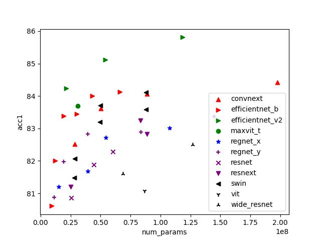

# TorchvisionModelPlot
plot all classification models in torchvision to check efficiency of
- latency
- parameters
- number of operations

efficientnet_v2 serise are most efficient in term of latency, parameters, number of oprations





## How to install

### User
```
python3.8 -m venv ~/venv/TorchvisionModelPlot
source ~/venv/TorchvisionModelPlot/bin/activate
pip install pip --upgrade
pip install -r requirements/common.txt
```

### Developer
```
pip install -r requirements/dev.txt
pre-commit install
```

## How to run
```
python3.8 plot_classification_models.py
```
